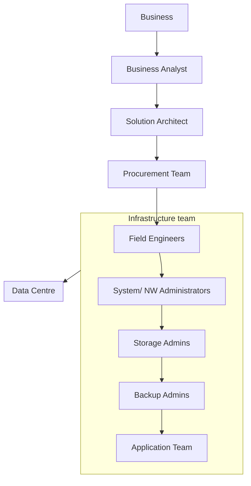

# Terraform Notes

---

## Motivations for Terraform

### Traditional Practices

### Problems with this model
1) Slow Deployment
2) Expensive
3) Limited Automation
4) Human Error
5) Wasted Resources (Hard to scale up and down)

## Infrastructure as Code tools (IaC)

*Can be roughly split into three categories*

### Server Templating
- Docker
- Packer
- Vagrant
### Provisioning Tools
- Terraform
- CloudFormation
### Configuration Management
- Anisble
- SaltStack
- Puppet

### Configuration Management
- Designed to Install and Manage Software
- Maintains Standard Structure
- Version Control
- Idempotent

### Server Templating Tools
- Pre Installed Software and Dependencies
- Virtual Machine of Docker Images
- Immutable Infrastructure

### Provisioning Tools
- Deploy Immutable Infrastructure resources
- Servers, Databases, Network Components etc.
- Multiple Providers

# Why Terraform

- Deploy infrastructure across different platforms
- How?
  - Achieved through providers managing providers through their APIs 

## HashiCorp Configuration Language (HCL)
- All configuration files are defined it .tf files
- Code is declarative
  - I.e the code is that state that we want our infrastructure to be in.
  - Terraform will figure out how to go from current state to desired state
- Terraform works in three phases
  - Init - Terraform initialises the project
  - Plan - Terraform drafts a plan to get to the target state
  - Apply - Terraform makes the necessary changes required on the target environment to bring it to the desired state
    - If for some reason the environment was to shift from the desired state, then a subsequent Terraform apply will bring it back to the desired state
- Every object that Terraform manages is called a resource
  - A resource can be a compute instance, a cloud database server or a physical on premise server that Terraform manages
  - Terraform manages the lifecycle of the resources from its provisioning to configuration and decommissioning
  - Terraform records the state of the infrastructure as it is seen in the real world and based on this, it can determine what actions to take when updating resources for a particular platform.
    - Terraform can ensure that the entire infrastructure is always in the defined state at all times.
    - The state is a blueprint of the infrastructure deployed by Terraform
    - Terraform can read attributes of existing infrastructure components by configuring data sources
      - This can later be used for configuring other resources within Terraform
      - Terraform can also import other resources outside of Terraform that were created manually or by the means of other IaC tools and bring it under its control so that it can manage those resources going forward.